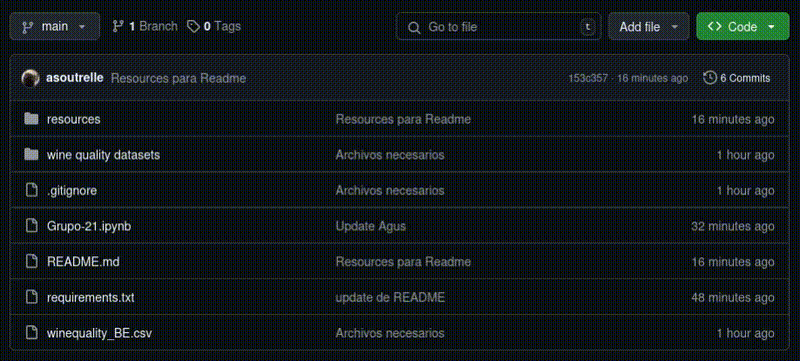
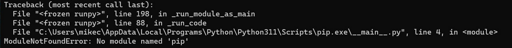

# Descarga de los archivos

# Creacion del entorno virtual
Vamos a utilizar el gestor de ambientes virtuales PIP (Python Package Installer)
## Linux
- Abrimos una consola en el path donde queramos tener el proyecto
- Ejecutar el comando `python -m venv <nombre del ambiente>` para crear el entorno virtual
- Inicializamos el entorno virtual `source envtpe/bin/activate`
- Instalamos el paquete de librerias `pip install requirements.txt`
## Windows
⚠️ **Advertencia** 
> Si no tenemos Python debemos instalarlo con el siguiente [link](https://www.python.org/downloads/) para poder utilizar
el comando pip.
> Si depues de instalar Python y ejecutar `pip` aparece el siguiente error
 [debemos configurar el path de windows](https://www.youtube.com/watch?v=B08TNPt7a-M)

- Abrimos una consola en el path donde queramos tener el proyecto
- Ejecutar el comando `python -m venv <nombre del ambiente>` para crear el entorno virtual
- Inicializamos el entorno virtual `source envtpe/bin/activate`
- Instalamos el paquete de librerias `pip install requirements.txt`