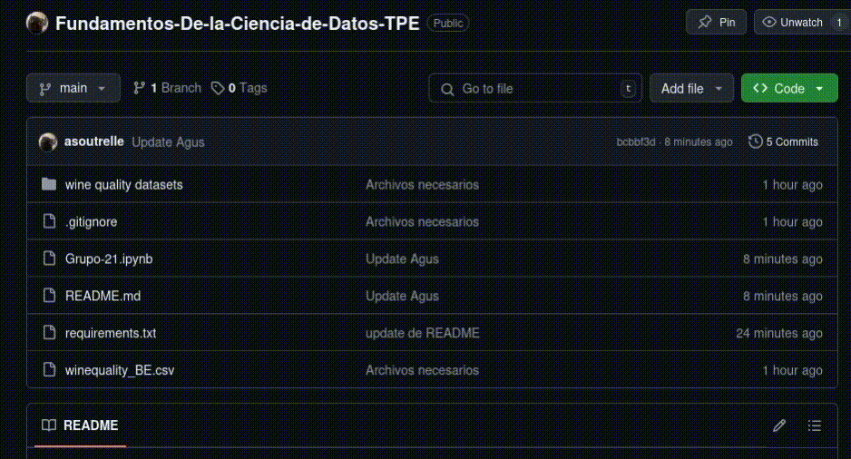

# Descarga de los archivos
Para descargar el repositorio sigue los pasos del siguiente gif

# Creacion del entorno virtual
Vamos a utilizar el gestor de ambientes virtuales PIP (Python Package Installer)
## Linux
- Abrimos una consola 
- Ejecutar el comando `python -m venv <nombre del ambiente>`
- Inicializamos el entorno virtual `source envtpe/bin/activate`
- Instalamos el paquete de librerias `pip install requirements.txt`
- 