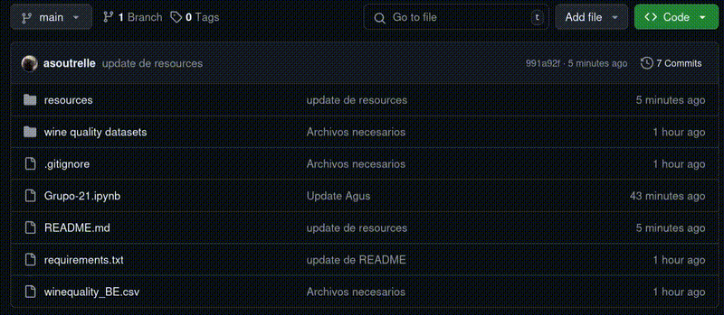

# Descarga de los archivos
## Opción 1: Descargar .zip

## Opción 2: clonar el repositorio
⚠️ **Advertencia**
> Para poder clonar el repositorio necesitamos [git](https://git-scm.com/)
[Aqui tienes un tutorial para instalar GIT](https://www.youtube.com/watch?v=jdXKwLNUfmg)
# Creación del entorno virtual
Vamos a utilizar el gestor de ambientes virtuales PIP (Python Package Installer)
## Linux
- Abrimos una consola en la ruta donde queramos tener el proyecto
- Ejecutar el comando `python -m venv <nombre del ambiente>` para crear el entorno virtual
- Inicializamos el entorno virtual `source envtpe/bin/activate`
- Instalamos el paquete de librerías `pip install -r requirements.txt`
## Windows
⚠️ **Advertencia**
> Si no tenemos Python debemos instalarlo con el siguiente [link](https://www.python.org/downloads/) para poder utilizar
el comando pip.
> Si después de instalar Python y ejecutar `pip` aparece el siguiente error

 

[debemos configurar el path de windows](https://www.youtube.com/watch?v=B08TNPt7a-M)

- Abrimos una consola en el path donde queramos tener el proyecto
- Ejecutar el comando `python -m venv <nombre del ambiente>` para crear el entorno virtual
- Inicializamos el entorno virtual `<nombre del ambiente>\Script\activate`
- Instalamos el paquete de librerías `pip install -r requirements.txt`

# Visualización del Notebook
## Vamos a utilizar el IDE VScode
- [Instalamos VScode](https://www.youtube.com/watch?v=X_Z7d04x9-E)
- En VScode, instalamos la extensiones de Jupyter Notebook

 
- Abrimos el archivo Grupo-21.ipynb en el IDE
- Seleccionamos el Kernel

⚠️ **Advertencia**
> Si no aparece tu entorno virtual, intenta reiniciar el IDE o abrir nuevamente la carpeta con los archivo

⚠️ **Advertencia 2**
> Prepararse una taza de Café o una copa de Vino